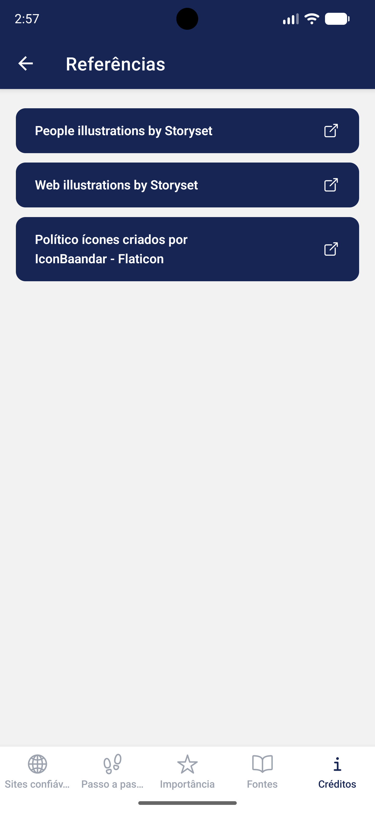

<p align="center">
  
</p>

<h1 align="center">PoliticAI</h1>

<p align="center">
  Informações confiáveis sobre eleições, política e cidadania no Brasil.
</p>

<p align="center">
  
  
  
  
  
</p>

---

## 🖥️ Telas do aplicativo

<p align="center">
  
  
  
  
  
  
  
  
  
</p>

---

## ✨ Principais Recursos

- 🏛️ **Fontes Confiáveis** — Centraliza informações diretamente do Tribunal Superior Eleitoral e outros sites oficiais.
- 🗺️ **Guias de Navegação** — Auxilia no acesso a dados eleitorais e informações sobre candidatos.
- 📱 **Interface Intuitiva** — Design limpo e organizado para uma experiência fluida.

---

## 🔧 Tech Stack

| Tecnologia                                                | Uso                                    |
| --------------------------------------------------------- | -------------------------------------- |
| [Expo 55](https://expo.dev)                               | Framework principal (managed workflow) |
| [React Native 0.83](https://reactnative.dev)              | Criação de interfaces nativas          |
| [TypeScript 5.9](https://www.typescriptlang.org)          | Tipagem estática (strict mode)         |
| [Expo Router](https://docs.expo.dev/router/introduction/) | Navegação baseada em rotas             |
| [NativeWind 4](https://www.nativewind.dev)                | Estilização com Tailwind CSS           |
| [Ionicons](https://ionic.io/ionicons)                     | Biblioteca de ícones                   |

---

## 🚀 Como rodar

**Pré-requisitos:** Node.js e npm instalados.

```bash
# Instalar dependências
npm install

# Iniciar o servidor de desenvolvimento
npx expo start
```

